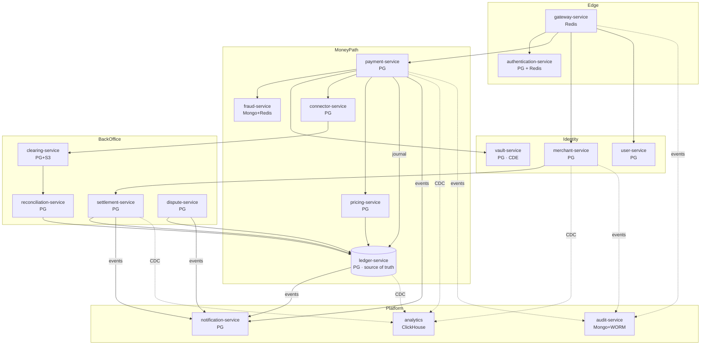
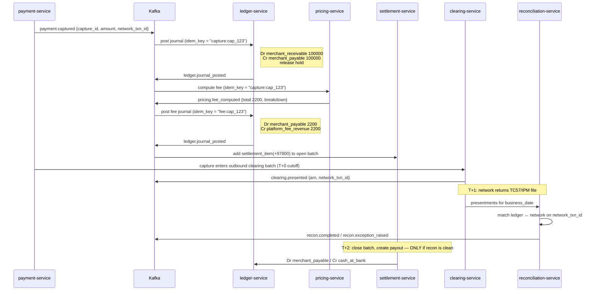

# Payment Processor Platform

This workspace contains a multi-module Spring Boot 3.x project for a payment processor platform.
Each service is scaffolded as its own module and is ready for further implementation.

# Payment Processor — Database-per-Service Design

> Scope: green-field card/account payment processor. This document defines the service boundaries, the datastore each
> service owns, the physical schema, and how the services relate **without** cross-database joins or foreign keys.

---

## 0. Review of the proposed service list

Your list is close, but it has three aggregate-splitting mistakes and four missing services. Money-movement systems fail
on exactly these seams, so I'm being blunt about the changes.

### Removed / merged

| Service                 | Verdict                           | Reason                                                                                                                                                                                                                                                                                            |
|-------------------------|-----------------------------------|---------------------------------------------------------------------------------------------------------------------------------------------------------------------------------------------------------------------------------------------------------------------------------------------------|
| `account-service`       | **Merged into `ledger-service`**  | "Balances, wallets, ledgers" *is* the ledger. Two services owning balances means two sources of truth for money. A wallet is just a ledger account with `owner_type='customer'`. Splitting them guarantees drift you'll only discover at month-end close.                                         |
| `transaction-service`   | **Deleted**                       | "Records every financial transaction" is what `ledger-service` (money) and `payment-service` (lifecycle) already do. A third write on the hot path that nobody reconciles against becomes a lying table within a year.                                                                            |
| `authorization-service` | **Merged into `payment-service`** | Auth, capture, void and refund mutate the **same aggregate** with the same invariant (`captured ≤ authorized`, `refunded ≤ captured`). Splitting it forces a distributed transaction on the lowest-latency path in the system. Keep the separate `authorizations` table, not a separate database. |
| `discovery-service`     | **Deleted**                       | Kubernetes DNS + a service mesh (Istio/Linkerd) does this. Don't run Eureka in 2026.                                                                                                                                                                                                              |
| `card-service`          | **Renamed `vault-service`**       | It isn't about cards, it's about *any* sensitive instrument (PAN, IBAN, network token). Naming it after PCI scope keeps the CDE boundary obvious to auditors.                                                                                                                                     |

### Added (these are not optional for a real processor)

| Service                  | Why it must exist                                                                                                                                                                  |
|--------------------------|------------------------------------------------------------------------------------------------------------------------------------------------------------------------------------|
| `dispute-service`        | Chargebacks. Regulated deadlines, network-specific reason codes, evidence files, liability shift. This never fits inside `payment-service`.                                        |
| `pricing-service`        | Interchange + scheme fees + merchant pricing. A processor's entire revenue lives here. Bitemporal data — you must recompute a fee *as of* the transaction date, not today's rates. |
| `connector-service`      | Acquirer/network adapters, MID mapping, smart routing, failover. Keeps ISO 8583 / ISO 20022 ugliness out of `payment-service`.                                                     |
| `analytics` (ClickHouse) | Replaces `reporting-service` on MongoDB. Reports are OLAP scans over 10⁹ rows. Mongo is the wrong tool; a columnar store fed by CDC is the right one.                              |

### Datastore changes I'm making to your table

| Service                            | You said | I say                               | Why                                                                                                                                                                                                                               |
|------------------------------------|----------|-------------------------------------|-----------------------------------------------------------------------------------------------------------------------------------------------------------------------------------------------------------------------------------|
| `notification-service`             | MongoDB  | **Postgres**                        | Webhook delivery needs a transactional outbox, per-merchant ordering, and retry state with `SELECT … FOR UPDATE SKIP LOCKED`. That's a queue problem, not a document problem.                                                     |
| `reporting-service`                | MongoDB  | **ClickHouse**                      | Aggregations over billions of rows. 50–100× faster, ~10× cheaper storage.                                                                                                                                                         |
| `account-service` / `card-service` | MySQL    | **Postgres**                        | Don't mix engines without a reason. Postgres gives you `numeric`, partial/expression indexes, `jsonb`, deferrable constraints, exclusion constraints, and logical decoding for CDC. MySQL earns its place nowhere in this system. |
| `audit-service`                    | MongoDB  | **MongoDB + S3 Object Lock**        | Keep Mongo for query, but the legal record must be WORM with a hash chain.                                                                                                                                                        |
| `fraud-service`                    | MongoDB  | **MongoDB + Redis + feature store** | Mongo for rules/assessments, Redis for velocity counters, Parquet/ClickHouse for offline features.                                                                                                                                |

### Final architecture

| #  | Service                  | Primary store  | Secondary          | Owns                                                 |
|----|--------------------------|----------------|--------------------|------------------------------------------------------|
| 1  | `gateway-service`        | —              | Redis              | Nothing durable. Rate limits, JWKS cache, routing.   |
| 2  | `authentication-service` | Postgres       | Redis              | Identities, credentials, MFA, API keys, sessions     |
| 3  | `user-service`           | Postgres       | —                  | End users, customers, profiles, addresses, consents  |
| 4  | `merchant-service`       | Postgres       | —                  | Merchants, KYB, owners, payout accounts, settings    |
| 5  | `vault-service`          | Postgres (CDE) | HSM/KMS            | Tokenized PANs, IBANs, network tokens, BIN data      |
| 6  | `payment-service`        | Postgres       | Redis              | Intents, authorizations, captures, refunds, 3DS      |
| 7  | `connector-service`      | Postgres       | Redis              | Acquirer configs, routing rules, network messages    |
| 8  | `fraud-service`          | MongoDB        | Redis + ClickHouse | Risk scores, rules, lists, devices, models           |
| 9  | `ledger-service`         | Postgres       | —                  | **The money.** Accounts, journals, entries, balances |
| 10 | `pricing-service`        | Postgres       | —                  | Interchange, scheme fees, merchant plans, FX         |
| 11 | `settlement-service`     | Postgres       | —                  | Batches, payouts, reserves                           |
| 12 | `clearing-service`       | Postgres       | S3                 | Network file exchange, presentments                  |
| 13 | `reconciliation-service` | Postgres       | S3                 | Matching, exceptions, adjustments                    |
| 14 | `dispute-service`        | Postgres       | S3                 | Chargebacks, evidence, representments                |
| 15 | `notification-service`   | Postgres       | —                  | Events, webhooks, email/SMS                          |
| 16 | `audit-service`          | MongoDB        | S3 WORM            | Immutable audit trail                                |
| 17 | `analytics`              | ClickHouse     | —                  | Read-only CDC replica. Owns nothing.                 |

---

## 1. Non-negotiable rules

1. **One schema, one owner.** No service reads another's tables. Not even read-only. Not even "just for reporting" —
   that's what CDC and the analytics store are for.
2. **No foreign keys across databases.** Cross-service references are opaque strings (`merchant_id text`), validated at
   the API edge, never by the DB.
3. **The ledger is the only truth about money.** `payment-service` knows *what the customer intended*; `ledger-service`
   knows *what money moved*. When they disagree, the ledger wins, and reconciliation raises an exception.
4. **Money is `bigint` in minor units + ISO-4217 code.** Never `float`. Never `decimal` without a currency column beside
   it. Exponent comes from a currency table (JPY=0, BHD=3).
5. **Entries are append-only.** No `UPDATE`, no `DELETE` on `ledger.entries`. Ever. Corrections are reversing journals.
   Enforce with a `BEFORE UPDATE OR DELETE` trigger that raises, plus `REVOKE UPDATE, DELETE` from the app role.
6. **Every mutating endpoint is idempotent** on `(merchant_id, idempotency_key)`.
7. **Every Postgres service has an `outbox` table** written in the same transaction as the state change. Debezium tails
   the WAL. No dual writes.
8. **Prefixed ULIDs, not UUIDv4.** `pi_01J9X…`, `mer_…`, `je_…`. Time-sortable (no B-tree page splits), self-describing
   in logs, safe to expose.

---

## 2. Service map



**Read the arrows as events, not calls.** Only the red-hot path (`payment → fraud`, `payment → vault`,
`payment → connector`) is synchronous. Everything else is Kafka.

---

## 3. Schemas

### 3.1 `authentication-service` — Postgres + Redis

Isolated from `user-service` on purpose: credentials have a different blast radius, different retention, and different
auditors than profile data.

```sql
CREATE TABLE identities (
  id            text PRIMARY KEY,               -- idn_01J...
  principal_type text NOT NULL,                 -- user | merchant_user | service
  email         citext UNIQUE,
  phone_e164    text UNIQUE,
  status        text NOT NULL DEFAULT 'active', -- active|locked|disabled
  email_verified_at timestamptz,
  created_at    timestamptz NOT NULL DEFAULT now(),
  updated_at    timestamptz NOT NULL DEFAULT now()
);

CREATE TABLE credentials (
  id            text PRIMARY KEY,
  identity_id   text NOT NULL REFERENCES identities(id) ON DELETE CASCADE,
  kind          text NOT NULL,                  -- password | passkey
  secret_hash   text NOT NULL,                  -- argon2id
  algo_params   jsonb NOT NULL,
  rotated_at    timestamptz,
  expires_at    timestamptz
);
CREATE UNIQUE INDEX ON credentials (identity_id) WHERE kind = 'password';

CREATE TABLE mfa_factors (
  id            text PRIMARY KEY,
  identity_id   text NOT NULL REFERENCES identities(id) ON DELETE CASCADE,
  kind          text NOT NULL,                  -- totp | sms | webauthn
  secret_ref    text NOT NULL,                  -- KMS key ref, NEVER the secret
  verified_at   timestamptz,
  status        text NOT NULL DEFAULT 'pending'
);

CREATE TABLE api_keys (
  id            text PRIMARY KEY,
  owner_type    text NOT NULL,                  -- merchant | platform
  owner_id      text NOT NULL,
  prefix        text NOT NULL UNIQUE,           -- sk_live_a1b2 -> shown in UI
  secret_hash   text NOT NULL,                  -- sha256; key shown once at creation
  scopes        text[] NOT NULL,
  environment   text NOT NULL,                  -- live | test
  last_used_at  timestamptz,
  expires_at    timestamptz,
  revoked_at    timestamptz
);
CREATE INDEX ON api_keys (owner_type, owner_id) WHERE revoked_at IS NULL;

-- Refresh-token rotation with reuse detection
CREATE TABLE refresh_tokens (
  id            text PRIMARY KEY,
  identity_id   text NOT NULL,
  family_id     text NOT NULL,                  -- reuse of any member => kill family
  token_hash    text NOT NULL UNIQUE,
  replaced_by   text REFERENCES refresh_tokens(id),
  issued_at     timestamptz NOT NULL DEFAULT now(),
  expires_at    timestamptz NOT NULL,
  revoked_at    timestamptz
);
CREATE INDEX ON refresh_tokens (family_id);

CREATE TABLE login_attempts (
  id bigserial, identity_id text, ip inet, user_agent text,
  result text NOT NULL, created_at timestamptz NOT NULL DEFAULT now()
) PARTITION BY RANGE (created_at);
```

**Redis:** `sess:{sid}` → identity + scopes (TTL 15m); `rl:{key}:{window}` token buckets; `jwks:current`. Access tokens
are short-lived JWTs signed by a KMS-held key; the gateway validates locally against cached JWKS so it never calls this
service on the hot path.

---

### 3.2 `user-service` — Postgres

Note the two-level model: a **user** is a platform-level person; a **customer** is a *merchant-scoped* buyer. Different
merchants must never see the same customer row.

```sql
CREATE TABLE users (
  id           text PRIMARY KEY,             -- usr_...
  identity_id  text NOT NULL UNIQUE,         -- -> authentication-service. No FK.
  status       text NOT NULL DEFAULT 'active',
  created_at   timestamptz NOT NULL DEFAULT now()
);

CREATE TABLE user_profiles (
  user_id      text PRIMARY KEY REFERENCES users(id) ON DELETE CASCADE,
  first_name   text, last_name text,
  date_of_birth date,
  locale       text NOT NULL DEFAULT 'en-US',
  timezone     text NOT NULL DEFAULT 'UTC',
  updated_at   timestamptz NOT NULL DEFAULT now()
);

CREATE TABLE customers (
  id           text PRIMARY KEY,             -- cus_...
  merchant_id  text NOT NULL,                -- -> merchant-service
  user_id      text REFERENCES users(id),    -- nullable: guest checkout
  external_ref text,                         -- merchant's own customer id
  email        citext, phone_e164 text,
  default_instrument_token text,             -- -> vault-service
  metadata     jsonb NOT NULL DEFAULT '{}',
  created_at   timestamptz NOT NULL DEFAULT now(),
  deleted_at   timestamptz
);
CREATE UNIQUE INDEX ON customers (merchant_id, external_ref) WHERE external_ref IS NOT NULL;
CREATE INDEX ON customers (merchant_id, email);

CREATE TABLE addresses (
  id           text PRIMARY KEY,
  owner_type   text NOT NULL,                -- user | customer | merchant
  owner_id     text NOT NULL,
  kind         text NOT NULL,                -- billing | shipping | registered
  line1 text NOT NULL, line2 text, city text, region text,
  postal_code  text, country char(2) NOT NULL,
  is_default   boolean NOT NULL DEFAULT false
);
CREATE UNIQUE INDEX ON addresses (owner_type, owner_id, kind) WHERE is_default;

CREATE TABLE consents (
  id text PRIMARY KEY, user_id text NOT NULL REFERENCES users(id),
  kind text NOT NULL,                        -- marketing | data_sharing | cof_mandate
  policy_version text NOT NULL,
  granted_at timestamptz NOT NULL, revoked_at timestamptz,
  evidence jsonb                             -- ip, ua, timestamp — needed for CoF disputes
);
```

GDPR erasure: `users` and `customers` are crypto-shredded (per-subject DEK destroyed), not `DELETE`d — the ledger must
keep referential integrity to a subject that no longer has readable PII.

---

### 3.3 `merchant-service` — Postgres

```sql
CREATE TABLE merchants (
  id             text PRIMARY KEY,           -- mer_...
  legal_name     text NOT NULL,
  display_name   text NOT NULL,
  country        char(2) NOT NULL,
  mcc            char(4),
  website        text,
  status         text NOT NULL DEFAULT 'draft',
     -- draft|pending_kyb|active|restricted|suspended|terminated
  risk_tier      text NOT NULL DEFAULT 'standard',
  created_at     timestamptz NOT NULL DEFAULT now(),
  updated_at     timestamptz NOT NULL DEFAULT now()
);

CREATE TABLE kyb_cases (
  id           text PRIMARY KEY,
  merchant_id  text NOT NULL REFERENCES merchants(id),
  provider     text NOT NULL,                -- persona | onfido | manual
  provider_ref text,
  status       text NOT NULL,                -- pending|approved|rejected|more_info
  decision_reason text,
  submitted_at timestamptz, decided_at timestamptz
);

CREATE TABLE kyb_documents (
  id text PRIMARY KEY, kyb_case_id text NOT NULL REFERENCES kyb_cases(id),
  doc_type text NOT NULL,                    -- incorporation | bank_letter | id
  storage_key text NOT NULL, sha256 bytea NOT NULL,
  status text NOT NULL DEFAULT 'uploaded'
);

CREATE TABLE beneficial_owners (
  id text PRIMARY KEY, merchant_id text NOT NULL REFERENCES merchants(id),
  full_name text NOT NULL, date_of_birth date,
  ownership_pct numeric(5,2) CHECK (ownership_pct BETWEEN 0 AND 100),
  is_control_person boolean NOT NULL DEFAULT false,
  id_doc_ref text, screening_status text        -- sanctions/PEP
);

CREATE TABLE merchant_users (
  id text PRIMARY KEY,
  merchant_id text NOT NULL REFERENCES merchants(id),
  identity_id text NOT NULL,                 -- -> authentication-service
  role text NOT NULL,                        -- owner|admin|developer|analyst|viewer
  status text NOT NULL DEFAULT 'active',
  UNIQUE (merchant_id, identity_id)
);

CREATE TABLE payout_accounts (
  id text PRIMARY KEY,
  merchant_id text NOT NULL REFERENCES merchants(id),
  kind text NOT NULL,                        -- bank | debit_card
  instrument_token text NOT NULL,            -- -> vault-service. Never raw IBAN here.
  currency char(3) NOT NULL, country char(2) NOT NULL,
  holder_name text NOT NULL,
  status text NOT NULL DEFAULT 'unverified',
  verified_at timestamptz,
  is_default boolean NOT NULL DEFAULT false
);
CREATE UNIQUE INDEX ON payout_accounts (merchant_id, currency) WHERE is_default;

CREATE TABLE merchant_settings (
  merchant_id text PRIMARY KEY REFERENCES merchants(id),
  statement_descriptor text NOT NULL,
  capture_mode text NOT NULL DEFAULT 'automatic',
  payout_cadence text NOT NULL DEFAULT 'daily',   -- daily|weekly|monthly|manual
  payout_delay_days int NOT NULL DEFAULT 2,
  reserve_rate_bps int NOT NULL DEFAULT 0,
  settings jsonb NOT NULL DEFAULT '{}'
);

CREATE TABLE merchant_limits (
  id text PRIMARY KEY, merchant_id text NOT NULL REFERENCES merchants(id),
  currency char(3) NOT NULL,
  per_txn_max_minor bigint, daily_max_minor bigint, monthly_max_minor bigint,
  UNIQUE (merchant_id, currency)
);
```

`merchant-service` publishes `merchant.activated`, `merchant.suspended`, `payout_account.verified`. `payment-service`
and `settlement-service` keep a **local read model** of `(merchant_id, status, currency, limits)` built from those
events — so the auth path never makes a synchronous call here.

---

### 3.4 `vault-service` — Postgres inside the PCI CDE

The only service in scope for PCI-DSS SAQ-D. Separate VPC, separate cluster, separate on-call, no shared credentials
with anything else. Everything else in this document handles only tokens.

```sql
CREATE TABLE instruments (
  id           text PRIMARY KEY,             -- card_... | ba_...
  token        text NOT NULL UNIQUE,         -- opaque, what other services store
  kind         text NOT NULL,                -- card | bank_account | wallet
  scope_merchant_id text,                    -- NULL = platform-wide token
  fingerprint  bytea NOT NULL,               -- HMAC-SHA256(PAN, pepper_in_HSM)
  created_at   timestamptz NOT NULL DEFAULT now(),
  deleted_at   timestamptz
);
-- Dedupe + velocity by fingerprint WITHOUT ever decrypting:
CREATE INDEX ON instruments (fingerprint);

CREATE TABLE card_details (
  instrument_id text PRIMARY KEY REFERENCES instruments(id),
  pan_ciphertext bytea NOT NULL,             -- AES-256-GCM under a per-record DEK
  dek_id       text NOT NULL REFERENCES dek_registry(id),
  nonce        bytea NOT NULL,
  aad          bytea NOT NULL,               -- binds ciphertext to instrument_id
  exp_month    smallint NOT NULL CHECK (exp_month BETWEEN 1 AND 12),
  exp_year     smallint NOT NULL,
  last4        char(4) NOT NULL,             -- safe: PCI allows first6+last4
  bin          char(8) NOT NULL,
  brand        text, funding text, issuer_country char(2), product_code text,
  cardholder_name_ciphertext bytea
);

CREATE TABLE bank_details (
  instrument_id text PRIMARY KEY REFERENCES instruments(id),
  account_ciphertext bytea NOT NULL, routing_ciphertext bytea,
  dek_id text NOT NULL, nonce bytea NOT NULL,
  last4 char(4) NOT NULL, bank_name text, country char(2) NOT NULL
);

-- Network tokens (Visa VTS / Mastercard MDES) — lifecycle-managed, survive card reissue
CREATE TABLE network_tokens (
  id text PRIMARY KEY,
  instrument_id text NOT NULL REFERENCES instruments(id),
  network text NOT NULL, token_ciphertext bytea NOT NULL,
  tar text, exp_month smallint, exp_year smallint,
  status text NOT NULL,                      -- active|suspended|deleted
  provisioned_at timestamptz, last_updated_at timestamptz
);

-- Envelope encryption: DEK per record, wrapped by KEK in HSM/KMS. Rotate KEK
-- without touching ciphertext; rotate DEK lazily on read.
CREATE TABLE dek_registry (
  id text PRIMARY KEY, kek_id text NOT NULL,
  wrapped_dek bytea NOT NULL,
  created_at timestamptz NOT NULL DEFAULT now(), rotated_at timestamptz
);

CREATE TABLE bin_ranges (               -- reference data, refreshed from networks
  bin_low bigint NOT NULL, bin_high bigint NOT NULL,
  brand text, funding text, issuer text, country char(2), product_code text,
  is_prepaid boolean, is_commercial boolean,
  EXCLUDE USING gist (int8range(bin_low, bin_high, '[]') WITH &&)  -- no overlaps
);

CREATE TABLE instrument_access_log (
  id bigserial, instrument_id text NOT NULL, actor text NOT NULL,
  purpose text NOT NULL,                     -- authorization | dispute_evidence
  correlation_id text, created_at timestamptz NOT NULL DEFAULT now()
) PARTITION BY RANGE (created_at);
```

**Detokenization is never a public API.** Only `connector-service` may call it, only with a purpose code, and only over
mTLS — and the response goes straight into the network message, never into a log or a response body.

---

### 3.5 `payment-service` — Postgres (the hot path)

```sql
CREATE TABLE payment_intents (
  id              text PRIMARY KEY,          -- pi_...
  merchant_id     text NOT NULL,
  customer_id     text,
  instrument_token text,
  amount_minor    bigint NOT NULL CHECK (amount_minor > 0),
  currency        char(3) NOT NULL,
  status          text NOT NULL,
  capture_method  text NOT NULL DEFAULT 'automatic',   -- automatic | manual
  -- denormalized rollups, guarded by CHECKs. This is the aggregate invariant.
  authorized_minor bigint NOT NULL DEFAULT 0,
  captured_minor   bigint NOT NULL DEFAULT 0,
  refunded_minor   bigint NOT NULL DEFAULT 0,
  statement_descriptor text,
  description     text,
  metadata        jsonb NOT NULL DEFAULT '{}',
  version         int NOT NULL DEFAULT 0,    -- optimistic lock
  created_at      timestamptz NOT NULL DEFAULT now(),
  updated_at      timestamptz NOT NULL DEFAULT now(),
  CHECK (captured_minor <= authorized_minor),
  CHECK (refunded_minor <= captured_minor)
) PARTITION BY RANGE (created_at);
CREATE INDEX ON payment_intents (merchant_id, created_at DESC);
CREATE INDEX ON payment_intents (status) WHERE status IN ('processing','requires_capture');

CREATE TABLE payment_attempts (
  id text PRIMARY KEY,
  intent_id text NOT NULL,
  attempt_no int NOT NULL,
  connector_id text,                          -- -> connector-service
  outcome text NOT NULL,                      -- approved|declined|error|timeout
  network_decline_code text, mapped_decline_code text,
  latency_ms int,
  created_at timestamptz NOT NULL DEFAULT now(),
  UNIQUE (intent_id, attempt_no)
);

CREATE TABLE authorizations (
  id text PRIMARY KEY,                        -- auth_...
  intent_id text NOT NULL, attempt_id text NOT NULL,
  amount_minor bigint NOT NULL, currency char(3) NOT NULL,
  status text NOT NULL,     -- approved|declined|expired|reversed|partially_captured|captured
  auth_code       text,
  network_txn_id  text,     -- Visa TransactionID / MC BankNet — needed for CoF + disputes
  rrn             text,     -- retrieval reference number
  arn             text,     -- acquirer reference number, arrives at clearing
  avs_result char(1), cvv_result char(1), eci char(2),
  three_ds_session_id text,
  expires_at timestamptz NOT NULL,            -- 7 days card-present, 30 days some MCCs
  created_at timestamptz NOT NULL DEFAULT now()
);
CREATE INDEX ON authorizations (intent_id);
CREATE INDEX ON authorizations (network_txn_id);
CREATE INDEX ON authorizations (expires_at) WHERE status = 'approved';  -- auth expiry sweeper

CREATE TABLE captures (
  id text PRIMARY KEY,                        -- cap_...
  authorization_id text NOT NULL REFERENCES authorizations(id),
  intent_id text NOT NULL,
  amount_minor bigint NOT NULL CHECK (amount_minor > 0),
  currency char(3) NOT NULL,
  status text NOT NULL,                       -- pending|succeeded|failed
  is_final boolean NOT NULL DEFAULT true,     -- false => more captures allowed
  ledger_journal_id text,                     -- -> ledger-service, set after posting
  network_ref text,
  captured_at timestamptz
);

CREATE TABLE refunds (
  id text PRIMARY KEY,                        -- re_...
  capture_id text REFERENCES captures(id),    -- NULL => unlinked refund
  intent_id text NOT NULL,
  amount_minor bigint NOT NULL CHECK (amount_minor > 0),
  currency char(3) NOT NULL,
  reason text,                                -- requested_by_customer|duplicate|fraudulent
  status text NOT NULL,
  ledger_journal_id text,
  network_ref text,
  created_at timestamptz NOT NULL DEFAULT now()
);

CREATE TABLE voids (
  id text PRIMARY KEY,
  authorization_id text NOT NULL REFERENCES authorizations(id),
  amount_minor bigint NOT NULL, status text NOT NULL,
  created_at timestamptz NOT NULL DEFAULT now()
);

CREATE TABLE three_ds_sessions (
  id text PRIMARY KEY, intent_id text NOT NULL,
  version text,                               -- 2.1 | 2.2
  status text NOT NULL,                       -- pending|challenge|authenticated|failed
  acs_url text, ds_trans_id text,
  cavv_ref text,                              -- pointer to vault, not the CAVV itself
  eci char(2), liability_shift boolean,
  exemption_applied text,                     -- TRA | low_value | SCA_delegation
  created_at timestamptz NOT NULL DEFAULT now()
);

CREATE TABLE idempotency_keys (
  merchant_id text NOT NULL,
  key         text NOT NULL,
  request_hash bytea NOT NULL,                -- 409 if same key, different body
  status      text NOT NULL,                  -- in_progress | completed
  response_code int, response_body jsonb,
  locked_at   timestamptz NOT NULL DEFAULT now(),
  expires_at  timestamptz NOT NULL DEFAULT now() + interval '24 hours',
  PRIMARY KEY (merchant_id, key)
);

CREATE TABLE outbox (
  id bigserial PRIMARY KEY,
  aggregate_id text NOT NULL, aggregate_type text NOT NULL,
  event_type text NOT NULL, payload jsonb NOT NULL,
  created_at timestamptz NOT NULL DEFAULT now(),
  published_at timestamptz
);
CREATE INDEX ON outbox (id) WHERE published_at IS NULL;
```

**Intent state machine:**

```
requires_payment_method
   → requires_confirmation
   → requires_action        (3DS challenge)
   → processing
   → requires_capture       (capture_method = manual)
   → succeeded
   ↘ canceled | failed
```

Guard it with a transition table + `CHECK`, not `if` statements scattered across the codebase:

```sql
CREATE TABLE intent_transitions (from_status text, to_status text, PRIMARY KEY (from_status,to_status));
```

---

### 3.6 `connector-service` — Postgres + Redis

```sql
CREATE TABLE connectors (
  id text PRIMARY KEY, code text NOT NULL UNIQUE,      -- visa_dps | adyen | stripe | fis
  kind text NOT NULL,                                   -- network|acquirer|psp|wallet|apm
  capabilities jsonb NOT NULL,                          -- {auth,capture,refund,void,3ds,tokenize}
  status text NOT NULL DEFAULT 'active'
);

CREATE TABLE merchant_connector_accounts (
  id text PRIMARY KEY,
  merchant_id text NOT NULL, connector_id text NOT NULL REFERENCES connectors(id),
  mid text NOT NULL,                                    -- acquirer merchant id
  terminal_id text,
  credentials_ref text NOT NULL,                        -- KMS/vault ref, never plaintext
  currencies char(3)[] NOT NULL, countries char(2)[] NOT NULL,
  priority int NOT NULL DEFAULT 100,
  status text NOT NULL DEFAULT 'active',
  UNIQUE (merchant_id, connector_id, mid)
);

CREATE TABLE routing_rules (
  id text PRIMARY KEY,
  merchant_id text,                                     -- NULL = platform default
  priority int NOT NULL,
  condition jsonb NOT NULL,   -- {brand:'visa', funding:'credit', country:'IN', amount_gt:500000}
  target_connector_id text NOT NULL,
  mode text NOT NULL DEFAULT 'primary',                 -- primary | fallback
  active boolean NOT NULL DEFAULT true
);
CREATE INDEX ON routing_rules (merchant_id, priority) WHERE active;

CREATE TABLE connector_requests (
  id bigserial,
  attempt_id text NOT NULL, connector_id text NOT NULL,
  request_ciphertext bytea NOT NULL,     -- PAN-bearing => encrypted at rest, 90d TTL
  response_ciphertext bytea,
  http_status int, latency_ms int,
  created_at timestamptz NOT NULL DEFAULT now()
) PARTITION BY RANGE (created_at);

CREATE TABLE network_messages (
  id bigserial, mti char(4), stan char(6), rrn text, arn text,
  direction text NOT NULL, raw bytea NOT NULL,          -- ISO 8583 / ISO 20022
  created_at timestamptz NOT NULL DEFAULT now()
) PARTITION BY RANGE (created_at);

CREATE TABLE connector_health (
  connector_id text NOT NULL, window_start timestamptz NOT NULL,
  success_rate numeric(5,4), p99_latency_ms int, volume int,
  PRIMARY KEY (connector_id, window_start)
);
```

Redis holds the circuit-breaker state and the resolved routing decision cache. `connector_health` drives **automatic
retry to a fallback acquirer** on soft declines — worth 1–3% of authorization rate, which is the single largest revenue
lever a processor has.

---

### 3.7 `fraud-service` — MongoDB + Redis + ClickHouse

Document store is genuinely right here: rule DSLs and feature vectors are schema-fluid and you never join them.

```javascript
// risk_assessments — write-heavy, TTL 400 days
{ _id: "ra_01J...", intent_id: "pi_01J...", merchant_id: "mer_...",
  score: 0.87, decision: "challenge",            // approve|challenge|review|decline
  triggered_rules: [{id:"r_9", name:"velocity_card_1h", weight:0.4}],
  features: { card_txn_1h: 7, ip_country: "IN", bin_country: "US",
              email_age_days: 2, device_new: true, amount_z: 3.1 },
  model: { name: "gbdt_cnp", version: "2026-05-03" },
  latency_ms: 34, created_at: ISODate() }

// rules — versioned, merchant-scoped or global
{ _id: "r_9", scope: {merchant_id: null}, name: "velocity_card_1h",
  expr: "features.card_txn_1h > 5 && features.bin_country != features.ip_country",
  action: "challenge", priority: 10, enabled: true, version: 4 }

// lists — block/allow
{ _id:..., merchant_id:"mer_...", list:"block", attribute:"card_fingerprint",
  value:"<hmac>", reason:"confirmed_fraud", expires_at: ISODate() }

// devices, cases, model_registry ...
```

Indexes: `{merchant_id:1, created_at:-1}`, `{intent_id:1}` unique, `{attribute:1, value:1}` on lists, TTL on
`expires_at`.

**Redis** carries the velocity counters the hot path reads in <2 ms — sliding windows keyed `v:card:{fp}:1h`,
`v:ip:{ip}:24h`, `v:email:{hash}:7d`. **ClickHouse** holds the offline feature store for training; features are computed
by one shared definition so training and serving can't skew.

Note what fraud-service does *not* have: PANs. It joins on `card_fingerprint` from the vault.

---

### 3.8 `ledger-service` — Postgres · **the heart of the system**

Everything else is plumbing. This is the part that must never be wrong. Design it first, freeze it early, and let no one
add a "quick column."

```sql
CREATE TABLE currencies (
  code char(3) PRIMARY KEY, exponent smallint NOT NULL   -- USD=2, JPY=0, BHD=3
);

CREATE TABLE account_types (
  code text PRIMARY KEY,
  classification text NOT NULL,           -- asset|liability|equity|revenue|expense
  normal_balance text NOT NULL            -- debit | credit
);
-- Seed:
--  merchant_receivable   asset     debit    money the network owes us for a merchant
--  merchant_payable      liability credit   money we owe the merchant
--  customer_wallet       liability credit   stored value (your "wallet")
--  platform_fee_revenue  revenue   credit
--  interchange_expense   expense   debit
--  scheme_fee_expense    expense   debit
--  cash_at_bank          asset     debit
--  network_clearing      asset     debit    in-flight with the scheme
--  reserve_held          liability credit
--  chargeback_liability  liability credit
--  fx_gain_loss          revenue   credit
--  suspense              asset     debit    unmatched money. Must trend to zero.

CREATE TABLE accounts (
  id           text PRIMARY KEY,            -- acc_...
  owner_type   text NOT NULL,               -- merchant|customer|platform|connector|network
  owner_id     text NOT NULL,               -- 'platform' for house accounts
  type_code    text NOT NULL REFERENCES account_types(code),
  currency     char(3) NOT NULL REFERENCES currencies(code),
  status       text NOT NULL DEFAULT 'active',
  created_at   timestamptz NOT NULL DEFAULT now(),
  UNIQUE (owner_type, owner_id, type_code, currency)
);

-- A journal = one balanced business event.
CREATE TABLE journals (
  id           text PRIMARY KEY,            -- je_...
  event_type   text NOT NULL,               -- capture|refund|fee|payout|chargeback|adjustment
  external_ref text,                        -- cap_..., re_..., po_...
  idempotency_key text NOT NULL UNIQUE,     -- <<< the whole design rests on this
  description  text,
  metadata     jsonb NOT NULL DEFAULT '{}',
  reverses_journal_id text REFERENCES journals(id),  -- corrections only
  posted_at    timestamptz NOT NULL DEFAULT now(),
  effective_at timestamptz NOT NULL,        -- business date != posting date
  created_by   text NOT NULL
);
CREATE INDEX ON journals (external_ref);
CREATE INDEX ON journals (effective_at);

-- APPEND ONLY. No UPDATE. No DELETE.
CREATE TABLE entries (
  id           bigserial,
  journal_id   text NOT NULL,
  account_id   text NOT NULL,
  direction    text NOT NULL CHECK (direction IN ('debit','credit')),
  amount_minor bigint NOT NULL CHECK (amount_minor > 0),   -- sign lives in direction
  currency     char(3) NOT NULL,
  effective_at timestamptz NOT NULL,
  PRIMARY KEY (id, effective_at)
) PARTITION BY RANGE (effective_at);
CREATE INDEX ON entries (account_id, effective_at);
CREATE INDEX ON entries (journal_id);

-- Materialized balance, updated in the SAME transaction as the entries.
CREATE TABLE account_balances (
  account_id     text PRIMARY KEY REFERENCES accounts(id),
  currency       char(3) NOT NULL,
  posted_minor   bigint NOT NULL DEFAULT 0,   -- settled
  pending_minor  bigint NOT NULL DEFAULT 0,   -- authorized, not captured
  held_minor     bigint NOT NULL DEFAULT 0,   -- reserves, dispute holds
  available_minor bigint GENERATED ALWAYS AS (posted_minor - held_minor) STORED,
  entry_high_water bigint NOT NULL DEFAULT 0,
  version        int NOT NULL DEFAULT 0,
  updated_at     timestamptz NOT NULL DEFAULT now()
);

-- Nightly. Lets you rebuild any balance in O(entries since snapshot).
CREATE TABLE balance_snapshots (
  account_id text NOT NULL, as_of_date date NOT NULL,
  posted_minor bigint NOT NULL, entry_high_water bigint NOT NULL,
  PRIMARY KEY (account_id, as_of_date)
);

CREATE TABLE holds (
  id text PRIMARY KEY, account_id text NOT NULL REFERENCES accounts(id),
  amount_minor bigint NOT NULL CHECK (amount_minor > 0), currency char(3) NOT NULL,
  reason text NOT NULL,                     -- auth_pending | reserve | dispute
  status text NOT NULL,                     -- active|released|captured|expired
  external_ref text, expires_at timestamptz,
  created_at timestamptz NOT NULL DEFAULT now()
);
CREATE INDEX ON holds (account_id) WHERE status = 'active';
CREATE INDEX ON holds (expires_at) WHERE status = 'active';
```

**The balance invariant, enforced by the database — not by hope:**

```sql
CREATE OR REPLACE FUNCTION assert_journal_balanced() RETURNS trigger AS $$
DECLARE bad int;
BEGIN
  SELECT count(*) INTO bad FROM (
    SELECT currency,
           sum(amount_minor) FILTER (WHERE direction='debit')
         - sum(amount_minor) FILTER (WHERE direction='credit') AS delta
    FROM entries WHERE journal_id = NEW.journal_id GROUP BY currency
  ) t WHERE delta <> 0;
  IF bad > 0 THEN
    RAISE EXCEPTION 'journal % is unbalanced', NEW.journal_id;
  END IF;
  RETURN NULL;
END $$ LANGUAGE plpgsql;

CREATE CONSTRAINT TRIGGER trg_journal_balanced
  AFTER INSERT ON entries
  DEFERRABLE INITIALLY DEFERRED
  FOR EACH ROW EXECUTE FUNCTION assert_journal_balanced();

-- Immutability
CREATE RULE entries_no_update AS ON UPDATE TO entries DO INSTEAD NOTHING;
CREATE RULE entries_no_delete AS ON DELETE TO entries DO INSTEAD NOTHING;
REVOKE UPDATE, DELETE ON entries FROM app_role;
```

`DEFERRABLE INITIALLY DEFERRED` is the trick: the check runs at `COMMIT`, so you can insert the debit and the credit as
separate rows and still be guaranteed the transaction cannot commit unbalanced. Cross-currency journals balance **per
currency** — an FX journal has a `fx_gain_loss` leg to make each side sum to zero.

**Worked example — ₹1,000 card capture, 2% + ₹2 fee, ₹8 interchange:**

| Account                                 |     Dr |    Cr |
|-----------------------------------------|-------:|------:|
| `merchant_receivable / mer_42 / INR`    | 100000 |       |
| `merchant_payable / mer_42 / INR`       |        | 97800 |
| `platform_fee_revenue / platform / INR` |        |  2200 |

and a separate journal when the network bills interchange:

| Account                                |  Dr |  Cr |
|----------------------------------------|----:|----:|
| `interchange_expense / platform / INR` | 800 |     |
| `network_clearing / visa / INR`        |     | 800 |

**Hot-account contention.** `account_balances` for `platform_fee_revenue` is a single row taking every write — that row
will serialize your entire throughput at ~500 TPS. Fix it with sharded sub-balances:

```sql
CREATE TABLE balance_shards (
  account_id text NOT NULL, shard smallint NOT NULL,  -- 0..63, hash(journal_id)
  posted_minor bigint NOT NULL DEFAULT 0,
  PRIMARY KEY (account_id, shard)
);
-- true balance = SUM(posted_minor). Roll shards up hourly.
```

Merchant accounts don't need this; house revenue/expense accounts do.

**Partitioning:** `entries` by month. After the fiscal year closes, detach and move to cold storage — the snapshot table
keeps balances correct without the old partitions attached.

---

### 3.9 `pricing-service` — Postgres

Bitemporal. You must be able to answer *"what was the interchange rate for a Visa credit consumer card at MCC 5411 in
India on 2025-11-03?"* two years later, after the rate has changed four times.

```sql
CREATE TABLE price_plans (
  id text PRIMARY KEY, name text NOT NULL,
  model text NOT NULL,                     -- blended | ic_plus | ic_plus_plus | flat
  version int NOT NULL, status text NOT NULL,
  UNIQUE (name, version)
);

CREATE TABLE pricing_rules (
  id text PRIMARY KEY, plan_id text NOT NULL REFERENCES price_plans(id),
  priority int NOT NULL,
  condition jsonb NOT NULL,   -- {brand, funding, region, mcc_group, is_3ds, volume_tier}
  percent_bps int NOT NULL DEFAULT 0,
  fixed_minor bigint NOT NULL DEFAULT 0,
  min_fee_minor bigint, max_fee_minor bigint,
  currency char(3) NOT NULL
);

CREATE TABLE merchant_price_plans (
  merchant_id text NOT NULL, plan_id text NOT NULL,
  valid_from timestamptz NOT NULL, valid_to timestamptz NOT NULL DEFAULT 'infinity',
  EXCLUDE USING gist (
    merchant_id WITH =, tstzrange(valid_from, valid_to) WITH &&
  )   -- <<< makes overlapping plans physically impossible
);

CREATE TABLE interchange_rates (
  id text PRIMARY KEY,
  network text NOT NULL, region text NOT NULL,
  product_code text NOT NULL, mcc_group text NOT NULL,
  percent_bps int NOT NULL, fixed_minor bigint NOT NULL, currency char(3) NOT NULL,
  valid_from date NOT NULL, valid_to date NOT NULL DEFAULT 'infinity'
);
CREATE INDEX ON interchange_rates (network, region, product_code, mcc_group, valid_from DESC);

CREATE TABLE scheme_fees (
  id text PRIMARY KEY, network text NOT NULL, fee_code text NOT NULL,
  calc jsonb NOT NULL,                     -- {basis:'per_txn'|'percent', value:…}
  valid_from date NOT NULL, valid_to date NOT NULL DEFAULT 'infinity'
);

-- Immutable record of what we actually charged, and why.
CREATE TABLE fee_calculations (
  id text PRIMARY KEY,
  source_type text NOT NULL,               -- capture | refund | chargeback | payout
  source_id text NOT NULL,
  merchant_id text NOT NULL,
  base_minor bigint NOT NULL, currency char(3) NOT NULL,
  total_fee_minor bigint NOT NULL,
  breakdown jsonb NOT NULL,   -- [{type:'interchange',amount:800,rule:'ic_v_cr_in_5411@2025-10-01'},
                              --  {type:'scheme',amount:120,...},{type:'markup',amount:1280,...}]
  plan_id text NOT NULL, plan_version int NOT NULL,
  ledger_journal_id text,
  computed_at timestamptz NOT NULL DEFAULT now(),
  UNIQUE (source_type, source_id)          -- idempotent: fee computed exactly once
);

CREATE TABLE fx_rates (
  id text PRIMARY KEY, base char(3) NOT NULL, quote char(3) NOT NULL,
  rate numeric(20,10) NOT NULL, markup_bps int NOT NULL DEFAULT 0,
  source text NOT NULL, valid_from timestamptz NOT NULL, valid_to timestamptz NOT NULL
);

CREATE TABLE fx_quotes (              -- rate locked and shown to the customer
  id text PRIMARY KEY, merchant_id text NOT NULL,
  base char(3), quote char(3), rate numeric(20,10) NOT NULL,
  created_at timestamptz NOT NULL DEFAULT now(), expires_at timestamptz NOT NULL
);
```

The `EXCLUDE USING gist` constraint on `merchant_price_plans` is the kind of thing that saves you a six-figure billing
incident. Application-level "check for overlap then insert" loses to a race; the constraint does not.

---

### 3.10 `settlement-service` — Postgres

```sql
CREATE TABLE settlement_batches (
  id text PRIMARY KEY,                     -- stl_...
  merchant_id text NOT NULL, currency char(3) NOT NULL,
  period_start timestamptz NOT NULL, period_end timestamptz NOT NULL,
  status text NOT NULL,   -- open|closed|reconciling|funding|paid|failed
  gross_minor bigint NOT NULL DEFAULT 0,
  refunds_minor bigint NOT NULL DEFAULT 0,
  fees_minor bigint NOT NULL DEFAULT 0,
  chargebacks_minor bigint NOT NULL DEFAULT 0,
  adjustments_minor bigint NOT NULL DEFAULT 0,
  reserve_minor bigint NOT NULL DEFAULT 0,
  net_minor bigint NOT NULL DEFAULT 0,
  ledger_journal_id text,
  created_at timestamptz NOT NULL DEFAULT now(), closed_at timestamptz
);
CREATE UNIQUE INDEX ON settlement_batches (merchant_id, currency, period_start);

CREATE TABLE settlement_items (
  id bigserial PRIMARY KEY,
  batch_id text NOT NULL REFERENCES settlement_batches(id),
  source_type text NOT NULL,   -- capture|refund|fee|chargeback|reversal|reserve_hold|reserve_release
  source_id text NOT NULL,
  amount_minor bigint NOT NULL,            -- signed here: +credit merchant, -debit
  currency char(3) NOT NULL,
  effective_at timestamptz NOT NULL,
  UNIQUE (batch_id, source_type, source_id) -- an item lands in exactly one batch, once
);

CREATE TABLE payouts (
  id text PRIMARY KEY,                     -- po_...
  batch_id text NOT NULL REFERENCES settlement_batches(id),
  merchant_id text NOT NULL,
  payout_account_id text NOT NULL,         -- -> merchant-service
  amount_minor bigint NOT NULL CHECK (amount_minor > 0),
  currency char(3) NOT NULL,
  rail text NOT NULL,                      -- sepa_ct|ach|wire|upi|faster_payments|push_to_card
  status text NOT NULL,  -- scheduled|submitted|in_transit|paid|returned|failed|canceled
  provider_ref text, idempotency_key text NOT NULL UNIQUE,
  ledger_journal_id text,
  scheduled_at timestamptz, submitted_at timestamptz, paid_at timestamptz,
  failure_code text
);
CREATE INDEX ON payouts (status, scheduled_at) WHERE status = 'scheduled';

CREATE TABLE payout_returns (
  id text PRIMARY KEY, payout_id text NOT NULL REFERENCES payouts(id),
  reason_code text NOT NULL, amount_minor bigint NOT NULL,
  returned_at timestamptz NOT NULL, ledger_journal_id text
);

CREATE TABLE reserves (
  id text PRIMARY KEY, merchant_id text NOT NULL,
  kind text NOT NULL,                      -- rolling | fixed | adhoc
  rate_bps int, amount_minor bigint NOT NULL, currency char(3) NOT NULL,
  source_batch_id text, hold_until date,
  status text NOT NULL,                    -- held | released
  ledger_hold_id text,                     -- -> ledger.holds
  created_at timestamptz NOT NULL DEFAULT now()
);
CREATE INDEX ON reserves (hold_until) WHERE status = 'held';
```

`settlement_items` is a **projection**, not truth — it's rebuilt from ledger entries. The
`UNIQUE (batch_id, source_type, source_id)` plus a "one open batch per merchant/currency" rule is what stops a capture
being paid out twice, which is the classic way processors lose real money.

---

### 3.11 `clearing-service` — Postgres + S3

Raw network files go to S3 (WORM, 10-year retention); Postgres holds the index and parsed rows.

```sql
CREATE TABLE network_files (
  id text PRIMARY KEY,
  network text NOT NULL,                   -- visa | mastercard | rupay | amex | nacha
  direction text NOT NULL,                 -- inbound | outbound
  file_type text NOT NULL,                 -- VSS-110|TC57|IPM|pacs.008|camt.054|NACHA
  business_date date NOT NULL,
  storage_uri text NOT NULL, sha256 bytea NOT NULL, size_bytes bigint,
  status text NOT NULL,                    -- received|parsing|parsed|failed|acked
  record_count int, control_total_minor bigint,
  received_at timestamptz NOT NULL DEFAULT now(), parsed_at timestamptz,
  UNIQUE (network, file_type, business_date, sha256)   -- re-delivery is a no-op
);

CREATE TABLE file_records (
  id bigserial,
  file_id text NOT NULL, seq int NOT NULL,
  record_type text NOT NULL, raw_line text NOT NULL, parsed jsonb NOT NULL,
  business_date date NOT NULL,
  PRIMARY KEY (id, business_date)
) PARTITION BY RANGE (business_date);

CREATE TABLE presentments (
  id text PRIMARY KEY,
  file_record_id bigint, network text NOT NULL,
  kind text NOT NULL,   -- first_presentment|second_presentment|chargeback|representment|fee_collection|funds_transfer
  arn text, rrn text, network_txn_id text,
  mid text, amount_minor bigint NOT NULL, currency char(3) NOT NULL,
  interchange_minor bigint, scheme_fee_minor bigint,
  txn_date date NOT NULL, business_date date NOT NULL,
  matched_capture_id text                  -- filled by reconciliation-service
);
CREATE INDEX ON presentments (arn);
CREATE INDEX ON presentments (network_txn_id);
CREATE INDEX ON presentments (business_date, kind);

CREATE TABLE outbound_batches (
  id text PRIMARY KEY, network text NOT NULL, business_date date NOT NULL,
  status text NOT NULL, record_count int, total_minor bigint,
  storage_uri text, submitted_at timestamptz, ack_ref text, ack_at timestamptz
);

CREATE TABLE network_calendars (
  network text NOT NULL, business_date date NOT NULL,
  cutoff_utc time NOT NULL, is_holiday boolean NOT NULL DEFAULT false,
  PRIMARY KEY (network, business_date)
);
```

`business_date` is not `created_at`. Visa's day ends at a network-defined cutoff, not midnight UTC, and everything
downstream (settlement windows, dispute clocks) keys off the network's day. Getting this wrong is a top-3 source of
reconciliation breaks.

---

### 3.12 `reconciliation-service` — Postgres

Three-way: **our ledger ↔ the network's file ↔ the bank statement.** Anything else is not reconciliation.

```sql
CREATE TABLE recon_runs (
  id text PRIMARY KEY,
  kind text NOT NULL,   -- ledger_vs_network | network_vs_bank | ledger_vs_bank | internal
  business_date date NOT NULL,
  status text NOT NULL, -- running|completed|failed
  matched_count int, unmatched_count int,
  variance_minor bigint, currency char(3),
  started_at timestamptz NOT NULL DEFAULT now(), finished_at timestamptz,
  UNIQUE (kind, business_date)
);

CREATE TABLE recon_records (
  id bigserial,
  run_id text NOT NULL, side text NOT NULL,        -- left | right
  source text NOT NULL,                             -- ledger | visa_tc57 | camt053
  match_key text NOT NULL,                          -- normalized ARN/RRN/network_txn_id
  amount_minor bigint NOT NULL, currency char(3) NOT NULL,
  business_date date NOT NULL, raw jsonb NOT NULL,
  PRIMARY KEY (id, business_date)
) PARTITION BY RANGE (business_date);
CREATE INDEX ON recon_records (run_id, side, match_key);

CREATE TABLE matches (
  id bigserial PRIMARY KEY,
  run_id text NOT NULL, left_id bigint NOT NULL, right_id bigint NOT NULL,
  strategy text NOT NULL,     -- exact_key | key_amount_date | fuzzy_amount_window | manual
  confidence numeric(4,3), matched_at timestamptz NOT NULL DEFAULT now(),
  matched_by text
);

CREATE TABLE exceptions (
  id text PRIMARY KEY,
  run_id text NOT NULL, record_id bigint, match_key text,
  reason text NOT NULL,
     -- missing_in_network | missing_in_ledger | amount_mismatch
     -- | date_mismatch | duplicate | currency_mismatch | orphan_settlement
  variance_minor bigint, currency char(3),
  severity text NOT NULL,                  -- low|medium|high|critical
  status text NOT NULL DEFAULT 'open',     -- open|investigating|resolved|written_off
  assignee text, resolution_note text,
  aging_days int GENERATED ALWAYS AS (0) STORED,   -- refreshed by job
  created_at timestamptz NOT NULL DEFAULT now(), resolved_at timestamptz
);
CREATE INDEX ON exceptions (status, severity, created_at) WHERE status <> 'resolved';

CREATE TABLE adjustments (
  id text PRIMARY KEY,
  exception_id text NOT NULL REFERENCES exceptions(id),
  amount_minor bigint NOT NULL, currency char(3) NOT NULL,
  ledger_journal_id text NOT NULL,         -- every adjustment MUST post to the ledger
  created_by text NOT NULL, approved_by text NOT NULL,   -- four-eyes, enforced
  created_at timestamptz NOT NULL DEFAULT now(),
  CHECK (created_by <> approved_by)
);

CREATE TABLE bank_statements (
  id text PRIMARY KEY, account_ref text NOT NULL,
  format text NOT NULL,                    -- camt.053 | BAI2 | MT940
  business_date date NOT NULL, opening_minor bigint, closing_minor bigint,
  storage_uri text NOT NULL, status text NOT NULL,
  UNIQUE (account_ref, business_date)
);
```

Matching cascade, run in order, cheapest first:

1. **Exact** — `network_txn_id` equality. ~97% of volume.
2. **Composite** — `(mid, amount, txn_date ±1)`. Catches ARN rewrites.
3. **Fuzzy** — amount within FX tolerance, date within a 3-day window, scored.
4. **Manual** — an ops queue. Everything that lands here is an `exception`.

`suspense` in the ledger is the pressure gauge: if it isn't near zero at close, matching is broken. Alert on `suspense`
balance, not on exception count.

---

### 3.13 `dispute-service` — Postgres

```sql
CREATE TABLE reason_code_catalog (
  network text NOT NULL, code text NOT NULL,
  category text NOT NULL,     -- fraud|authorization|processing_error|consumer_dispute
  description text NOT NULL,
  response_days int NOT NULL,
  evidence_required jsonb NOT NULL,
  PRIMARY KEY (network, code)
);

CREATE TABLE disputes (
  id text PRIMARY KEY,                     -- dp_...
  merchant_id text NOT NULL,
  intent_id text NOT NULL, capture_id text,   -- -> payment-service
  network text NOT NULL, case_number text, arn text, network_txn_id text,
  reason_code text NOT NULL,
  stage text NOT NULL,   -- retrieval|chargeback|representment|pre_arbitration|arbitration
  status text NOT NULL,  -- needs_response|under_review|won|lost|accepted|expired
  amount_minor bigint NOT NULL, currency char(3) NOT NULL,
  is_partial boolean NOT NULL DEFAULT false,
  opened_at timestamptz NOT NULL,
  respond_by timestamptz NOT NULL,         -- <<< regulatory clock. Alert at 72h.
  closed_at timestamptz,
  ledger_hold_id text, ledger_journal_id text,
  FOREIGN KEY (network, reason_code) REFERENCES reason_code_catalog(network, code),
  UNIQUE (network, case_number)
);
CREATE INDEX ON disputes (merchant_id, status);
CREATE INDEX ON disputes (respond_by) WHERE status = 'needs_response';

CREATE TABLE dispute_events (
  id bigserial PRIMARY KEY, dispute_id text NOT NULL REFERENCES disputes(id),
  kind text NOT NULL, actor text NOT NULL, payload jsonb NOT NULL,
  created_at timestamptz NOT NULL DEFAULT now()
);

CREATE TABLE evidence (
  id text PRIMARY KEY, dispute_id text NOT NULL REFERENCES disputes(id),
  kind text NOT NULL,   -- receipt|shipping_proof|avs_result|3ds_result|comms|refund_policy
  storage_key text NOT NULL, sha256 bytea NOT NULL,
  page_count int, submitted_at timestamptz, status text NOT NULL
);

CREATE TABLE representments (
  id text PRIMARY KEY, dispute_id text NOT NULL REFERENCES disputes(id),
  submitted_at timestamptz NOT NULL, network_ref text,
  outcome text, decided_at timestamptz
);

CREATE TABLE liability (
  id text PRIMARY KEY, dispute_id text NOT NULL REFERENCES disputes(id),
  party text NOT NULL,                     -- merchant|issuer|acquirer|platform
  amount_minor bigint NOT NULL, currency char(3) NOT NULL,
  ledger_journal_id text NOT NULL
);
```

Money moves at **stage transitions**, and each transition posts a journal:
`chargeback received` → debit merchant_payable, credit chargeback_liability (+ ledger hold);
`won` → reverse it; `lost` → debit chargeback_liability, credit network_clearing, plus a chargeback fee via
`pricing-service`.

Also track the **chargeback ratio** per merchant per month — Visa VDMP/VAMP and Mastercard ECP thresholds (≈0.9% / 1%)
put you in a monitoring program if a merchant breaches. This is a materialized view here, surfaced to `merchant-service`
as a risk event.

---

### 3.14 `notification-service` — Postgres

```sql
CREATE TABLE events (
  id text PRIMARY KEY,                     -- evt_...
  merchant_id text NOT NULL,
  type text NOT NULL,                      -- payment.succeeded | dispute.opened | ...
  aggregate_type text NOT NULL, aggregate_id text NOT NULL,
  api_version text NOT NULL,
  payload jsonb NOT NULL,
  sequence bigint NOT NULL,                -- monotonic PER MERCHANT => ordered delivery
  created_at timestamptz NOT NULL DEFAULT now(),
  UNIQUE (merchant_id, sequence)
) PARTITION BY RANGE (created_at);

CREATE TABLE webhook_endpoints (
  id text PRIMARY KEY, merchant_id text NOT NULL,
  url text NOT NULL, secret_ref text NOT NULL,     -- HMAC signing key in KMS
  subscribed_types text[] NOT NULL,
  api_version text NOT NULL,
  status text NOT NULL DEFAULT 'active',           -- active|disabled|auto_disabled
  consecutive_failures int NOT NULL DEFAULT 0,
  created_at timestamptz NOT NULL DEFAULT now()
);

CREATE TABLE webhook_deliveries (
  id bigserial,
  endpoint_id text NOT NULL, event_id text NOT NULL,
  attempt int NOT NULL DEFAULT 0,
  status text NOT NULL,                    -- pending|delivering|delivered|failed|dead
  next_retry_at timestamptz,
  response_code int, response_ms int, error text,
  created_at timestamptz NOT NULL DEFAULT now(),
  PRIMARY KEY (id, created_at),
  UNIQUE (endpoint_id, event_id, created_at)   -- exactly one delivery row per event
) PARTITION BY RANGE (created_at);
CREATE INDEX ON webhook_deliveries (next_retry_at) WHERE status = 'pending';

CREATE TABLE templates (
  id text PRIMARY KEY, key text NOT NULL, channel text NOT NULL,
  locale text NOT NULL, subject text, body text NOT NULL, version int NOT NULL,
  UNIQUE (key, channel, locale, version)
);

CREATE TABLE messages (
  id text PRIMARY KEY, channel text NOT NULL,     -- email|sms|push
  template_id text, recipient_hash bytea NOT NULL, -- hashed: don't duplicate PII here
  locale text, status text NOT NULL, provider text, provider_ref text,
  sent_at timestamptz, created_at timestamptz NOT NULL DEFAULT now()
);

CREATE TABLE suppressions (
  channel text NOT NULL, recipient_hash bytea NOT NULL,
  reason text NOT NULL,                    -- bounce|complaint|unsubscribe
  created_at timestamptz NOT NULL DEFAULT now(),
  PRIMARY KEY (channel, recipient_hash)
);
```

Dispatcher: `SELECT … FOR UPDATE SKIP LOCKED` on `next_retry_at <= now()`, exponential backoff (
`5s, 30s, 2m, 10m, 1h, 6h, 24h`), auto-disable an endpoint after N consecutive failures, and a per-merchant ordering
guarantee via the `sequence` column. Retention: 90 days, then partition drop.

---

### 3.15 `audit-service` — MongoDB + S3 Object Lock

```javascript
{ _id: "aud_01J...",
  ts: ISODate("2026-07-15T09:14:22.113Z"),
  actor: { type:"merchant_user", id:"idn_…", ip:"203.0.113.9", ua:"…" },
  action: "payout_account.update",
  resource: { type:"payout_account", id:"pa_…" },
  merchant_id: "mer_42",
  before: { last4:"4242" }, after: { last4:"9910" },   // redacted, never raw
  request_id: "req_…", trace_id: "…",
  prev_hash: "sha256:…", hash: "sha256:…"              // tamper-evident chain
}
```

Indexes `{merchant_id:1, ts:-1}`, `{"resource.type":1,"resource.id":1,ts:-1}`, `{action:1, ts:-1}`. Mongo is the *query*
copy; the *legal* copy is a daily signed batch in S3 with Object Lock (compliance mode). Hash-chain each record to the
previous so any tampering is detectable; anchor the daily root hash externally. Retention: 7–10 years depending on
jurisdiction. Never delete — audit records are exempt from GDPR erasure under legal-obligation grounds, which is exactly
why they must contain **no raw PII**, only references.

---

### 3.16 `analytics` — ClickHouse (owns nothing)

Fed by Debezium → Kafka → ClickHouse. Kimball star schema:

```sql
CREATE TABLE fact_payments (
  intent_id String, merchant_id LowCardinality(String),
  created_date Date, created_at DateTime64(3),
  amount_minor Int64, currency LowCardinality(FixedString(3)),
  status LowCardinality(String), connector LowCardinality(String),
  card_brand LowCardinality(String), issuer_country LowCardinality(FixedString(2)),
  is_3ds UInt8, risk_score Float32,
  fee_minor Int64, interchange_minor Int64,
  decline_code LowCardinality(String)
) ENGINE = MergeTree
PARTITION BY toYYYYMM(created_date)
ORDER BY (merchant_id, created_date, intent_id);

-- plus fact_ledger_entries, fact_settlements, fact_disputes,
--      dim_merchant (ReplacingMergeTree), dim_bin, dim_time
```

`ORDER BY (merchant_id, created_date, …)` because ~95% of dashboard queries filter by merchant then date. Auth-rate,
decline-reason, and fraud-rate dashboards become sub-second at 10⁹ rows.

**Reports never query OLTP.** Not once. The moment a merchant dashboard runs
`SELECT count(*) FROM payment_intents WHERE merchant_id = …` you have coupled your revenue to someone's date-range
picker.

---

## 4. How the services relate

### 4.1 The reference graph (no FKs — these are all opaque IDs)

| From                                    | Field                        | To                                      | Resolved by               |
|-----------------------------------------|------------------------------|-----------------------------------------|---------------------------|
| `user.customers`                        | `merchant_id`                | `merchant.merchants.id`                 | event-sourced local cache |
| `user.customers`                        | `default_instrument_token`   | `vault.instruments.token`               | sync call, CDE-only       |
| `payment.payment_intents`               | `merchant_id`, `customer_id` | merchant / user                         | local read model          |
| `payment.payment_intents`               | `instrument_token`           | `vault.instruments.token`               | never dereferenced here   |
| `payment.captures`                      | `ledger_journal_id`          | `ledger.journals.id`                    | saga, set on ack          |
| `connector.merchant_connector_accounts` | `merchant_id`                | merchant                                | event                     |
| `fraud.risk_assessments`                | `intent_id`                  | payment                                 | event                     |
| `ledger.accounts`                       | `owner_id`                   | merchant / user / connector             | event                     |
| `pricing.fee_calculations`              | `source_id`                  | `payment.captures.id`                   | event                     |
| `settlement.settlement_items`           | `source_id`                  | capture / refund / fee / dispute        | ledger CDC                |
| `settlement.payouts`                    | `payout_account_id`          | `merchant.payout_accounts.id`           | sync call                 |
| `clearing.presentments`                 | `network_txn_id`             | `payment.authorizations.network_txn_id` | recon                     |
| `dispute.disputes`                      | `capture_id`                 | `payment.captures.id`                   | sync call                 |
| `recon.adjustments`                     | `ledger_journal_id`          | `ledger.journals.id`                    | sync call                 |

**`network_txn_id` is the join key of the entire back office.** Visa's TransactionID / Mastercard's BanknetRefNo is the
only identifier that survives the round trip: auth → clearing file → settlement report → chargeback, days or months
later. Capture it at authorization, index it in `payment-service`, `clearing-service` and `dispute-service`, and never
let it be nullable in practice. Systems that try to reconcile on ARN alone break, because ARNs get rewritten on partial
captures and multi-clearing.

### 4.2 The authorization path (synchronous, budget ≈ 300 ms)

```mermaid
sequenceDiagram
  participant C as Client
  participant GW as gateway
  participant PAY as payment-service
  participant FRD as fraud-service
  participant CON as connector-service
  participant VLT as vault-service
  participant NET as Network
  participant LED as ledger-service

  C->>GW: POST /payment_intents/confirm (Idempotency-Key)
  GW->>PAY: authN via cached JWKS (no network hop)
  PAY->>PAY: INSERT idempotency_keys (in_progress) — dedupes retries
  PAY->>FRD: score(intent, features)          %% ~40ms
  FRD-->>PAY: {decision: approve, score: .12}
  PAY->>CON: authorize(token, amount, mid)
  CON->>VLT: detokenize(token, purpose=authorization)  %% mTLS, CDE only
  VLT-->>CON: PAN (in-memory only, never logged)
  CON->>NET: ISO 8583 0100                    %% ~180ms
  NET-->>CON: 0110 approved, auth_code, network_txn_id
  CON-->>PAY: approved
  PAY->>PAY: INSERT authorizations; UPDATE intent; INSERT outbox  %% ONE txn
  PAY-->>C: 200 {status: requires_capture}
  Note over PAY,LED: async from here
  PAY--)LED: payment.authorized -> create HOLD (pending_minor), no posting
  LED--)PAY: ack
```

Note what is **not** in the hot path: no ledger posting (an auth isn't money yet — it's a hold), no fee calculation, no
merchant-service call, no settlement. Each of those would add latency and a failure mode to the one call that must not
fail.

### 4.3 Capture → settlement saga (asynchronous, choreographed)



**Compensation, not rollback.** If `pricing-service` is down, the capture journal has already posted and the merchant's
`merchant_payable` is temporarily too high — that's fine and correct, because the fee journal is a *separate* business
event that will post when pricing recovers. The settlement batch simply won't close until every expected fee journal
exists. Never try to two-phase-commit across a payment DB and a ledger DB; you'll get neither performance nor
correctness.

**Every consumer is idempotent by construction.** The ledger's `journals.idempotency_key UNIQUE` means Kafka's
at-least-once delivery is harmless: a redelivered `payment.captured` tries to insert `"capture:cap_123"`, hits the
unique violation, and returns the existing journal. That single constraint is worth more than any amount of exactly-once
middleware.

### 4.4 Chargeback flow

```
clearing-service parses chargeback record from network file
        ↓ (match on network_txn_id)
dispute-service creates dispute { stage: chargeback, respond_by: opened_at + response_days }
        ↓
ledger-service: Dr merchant_payable, Cr chargeback_liability + HOLD
        ↓
notification-service: dispute.opened webhook (merchant has N days)
        ↓
merchant uploads evidence → representment → clearing-service outbound file
        ↓
network decision arrives T+30..45
        ├─ won  → ledger reverses the hold journal
        └─ lost → Dr chargeback_liability, Cr network_clearing; pricing adds dispute fee
        ↓
settlement-service picks up the net as a settlement_item on the next batch
```

---

## 5. Cross-cutting decisions

### 5.1 Consistency model

| Boundary                 | Guarantee             | Mechanism                                                    |
|--------------------------|-----------------------|--------------------------------------------------------------|
| Within `payment-service` | Strong (serializable) | Single Postgres txn + optimistic lock on `version`           |
| Within `ledger-service`  | Strong                | Deferred balance trigger, `SERIALIZABLE` for balance updates |
| `payment` ↔ `ledger`     | Eventual, ~seconds    | Outbox + Kafka + idempotent consumer                         |
| `ledger` ↔ `settlement`  | Eventual, ~minutes    | CDC; batch won't close until complete                        |
| Ledger ↔ network         | Eventual, T+1/T+2     | Reconciliation; breaks become exceptions                     |
| Anything ↔ analytics     | Eventual, ~seconds    | Debezium CDC                                                 |

### 5.2 Partitioning & sharding path

Don't shard on day one. Do build for it:

- **Partition now** (single node, huge win): `entries` by month, `payment_intents` by month, `connector_requests`/
  `network_messages`/`webhook_deliveries` by month with a drop-partition retention job.
- **Read replicas next**: merchant dashboards → replica; hot path → primary only.
- **Shard last, on `merchant_id`.** It is the natural tenant key and it appears in every hot query. `ledger.accounts`
  shards cleanly by `owner_id` since journals are almost always within a single merchant's accounts — the exception is
  journals touching a platform house account, which need a cross-shard 2PC or a per-shard house sub-account rolled up
  nightly. Prefer the sub-account approach.
- **Never shard on `created_at`** — every shard-add rewrites your hot partition.

### 5.3 Where PII and PCI data live

| Class                     | Only in                            | Everywhere else              |
|---------------------------|------------------------------------|------------------------------|
| PAN, CVV, IBAN            | `vault-service` (CDE)              | token + `last4` + `bin`      |
| Name, email, DOB, address | `user-service`, `merchant-service` | `customer_id`, `merchant_id` |
| Credentials, MFA secrets  | `authentication-service` + KMS     | `identity_id`                |
| Money                     | `ledger-service`                   | journal ids                  |

CVV is **never stored**, not encrypted, not for a second — PCI-DSS 3.2 forbids storage post-authorization. It exists
only in memory inside `connector-service` for the duration of one auth message.

Encryption: TLS 1.3 in transit + mTLS between services; AES-256-GCM at rest with envelope encryption (per-record DEK,
KEK in HSM/KMS); per-subject DEK for user PII so GDPR erasure is a key deletion, not a `DELETE` cascade through your
ledger.

### 5.4 Retention

| Data                     | Retention              | Why                               |
|--------------------------|------------------------|-----------------------------------|
| `ledger.entries`         | 10 years               | Financial regulation              |
| `audit_events`           | 7–10 years             | Regulation; WORM                  |
| `clearing.network_files` | 7 years                | Network mandate + dispute defence |
| `payment_intents`        | 7 years (cold after 2) | Dispute + tax                     |
| `connector_requests`     | 90 days                | PAN-adjacent — minimize           |
| `webhook_deliveries`     | 90 days                | Operational only                  |
| `risk_assessments`       | 400 days               | Model training + dispute evidence |
| `sessions`               | 15 min – 30 days       | Security                          |

### 5.5 The operational invariants worth alerting on

These are the checks that catch a bug before a regulator does. Run them continuously, not at month-end.

1. `SUM(debits) = SUM(credits)` across **all** entries, per currency. Continuously. Non-negotiable.
2. `account_balances.posted_minor = SUM(entries)` for a random 1% of accounts every hour. Drift means your
   materialization has a bug.
3. `ledger.suspense` balance trends to zero. If it grows, matching is broken.
4. `payment.captured_minor` total = `SUM(ledger entries WHERE event_type='capture')`. Cross-service check between the
   two "truths".
5. No `merchant_payable` account is negative unless the merchant has an approved negative-balance agreement.
6. Every `capture` older than 1 hour has a non-null `ledger_journal_id`. Catches stuck sagas.
7. Open `exceptions` aged > 5 business days = paging incident.
8. `authorizations` past `expires_at` with `status='approved'` = money you're about to lose.

---

## 6. Build order

You cannot build 17 services at once. Build them in dependency order and make each one earn the next.

| Phase | Ship                                                                   | Why here                                                                                                                                                                                    |
|-------|------------------------------------------------------------------------|---------------------------------------------------------------------------------------------------------------------------------------------------------------------------------------------|
| **1** | `ledger-service`, `authentication-service`, `merchant-service`         | The ledger's schema is the hardest thing to change later. Get double-entry, currencies, and the balance trigger right while nothing depends on them.                                        |
| **2** | `vault-service`, `payment-service`, `connector-service` (one acquirer) | Now you can take a payment. One connector only — the abstraction is only proven by the second one.                                                                                          |
| **3** | `pricing-service`, `settlement-service`                                | Now you can make and pay out money. Before this, you're a demo.                                                                                                                             |
| **4** | `clearing-service`, `reconciliation-service`                           | The moment you have real volume, you need to prove your ledger matches the network. Do not delay this — retro-fitting reconciliation onto a year of unmatched data is a project on its own. |
| **5** | `fraud-service`, `dispute-service`                                     | Fraud starts with static rules + velocity in Redis; the ML model comes after you have labeled data (i.e. after disputes exist).                                                             |
| **6** | `notification-service`, `audit-service`, `analytics`                   | Platform. Audit's hash-chain should arguably move to phase 1 if your regulator is watching.                                                                                                 |

**Start with a modular monolith over a shared Postgres cluster with one schema per service and zero cross-schema
queries.** You get the boundaries without the distributed-systems tax. When a schema needs its own scaling or compliance
envelope — `vault-service` first, then `ledger-service` — cut it out. The boundaries in this document are drawn so that
extraction is a deployment change, not a redesign.

---

## 7. Summary of the argument

- **Merge `account-service` into `ledger-service`.** One source of truth for money or you will have none.
- **Delete `transaction-service`.** It's a third copy of data two services already own correctly.
- **Merge `authorization-service` into `payment-service`.** Never split an aggregate across a network boundary —
  especially not the latency-critical one.
- **Add `dispute-service` and `pricing-service`.** Chargebacks and fees aren't features; they're half the business.
- **Standardize on Postgres**; use Mongo only where the schema is genuinely fluid (fraud rules, audit), ClickHouse for
  anything analytical, Redis only for things you're willing to lose.
- **`network_txn_id` is the spine** of everything after authorization.
- **Idempotency keys + a transactional outbox + an append-only ledger** are the three primitives that make at-least-once
  messaging safe. Get those three right and the rest is CRUD.